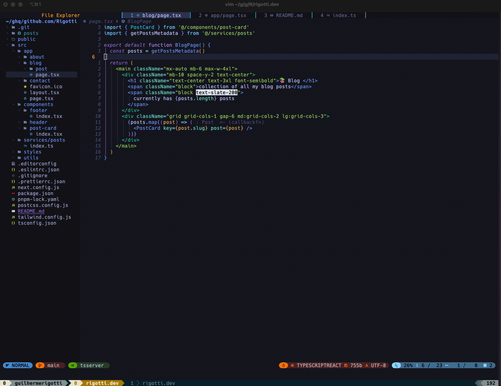

I used Visual Studio Code (VSCode) for years and it served me well, but I recently switched to Neovim. Here's why.

Neovim is a fork of Vim, a highly customizable text editor that's been around since the 90s. It's built to be more modern and extensible than Vim, with a focus on making it easier to develop plugins and integrate with other tools. It also has a more consistent and flexible scripting language, which makes it easier to automate tasks and customize your workflow.

Here's what pushed me to switch:

## Performance

VSCode is a good editor, but it can get slow and bloated. Neovim is lightweight and fast: it loads almost instantly, and I can open and switch between files with no lag.

## Customizability

Neovim has an extensive plugin ecosystem. With a few tweaks to my configuration file, I built an environment that fits how I actually work. VSCode is also customizable, but getting it to behave the way I wanted meant installing a lot of extensions.

## Modal editing

Neovim uses a modal editing system: different keystrokes do different things depending on which mode you're in. It takes some getting used to, but once it clicks, it speeds up your workflow noticeably. VSCode sticks to a more traditional editor interface.

## Terminal integration

I can run shell commands and interact with my terminal directly from inside Neovim, without switching to a separate window. That alone changed how I move through my day-to-day work.

There was a learning curve at first, but the switch paid off. If you're curious, give Neovim a try.
